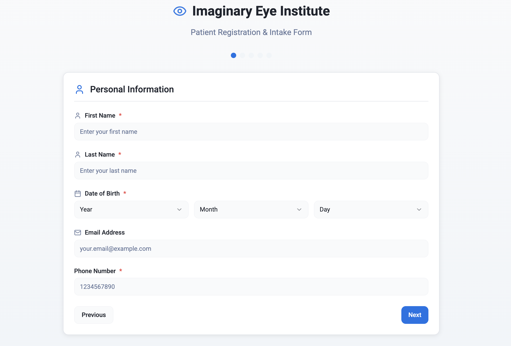
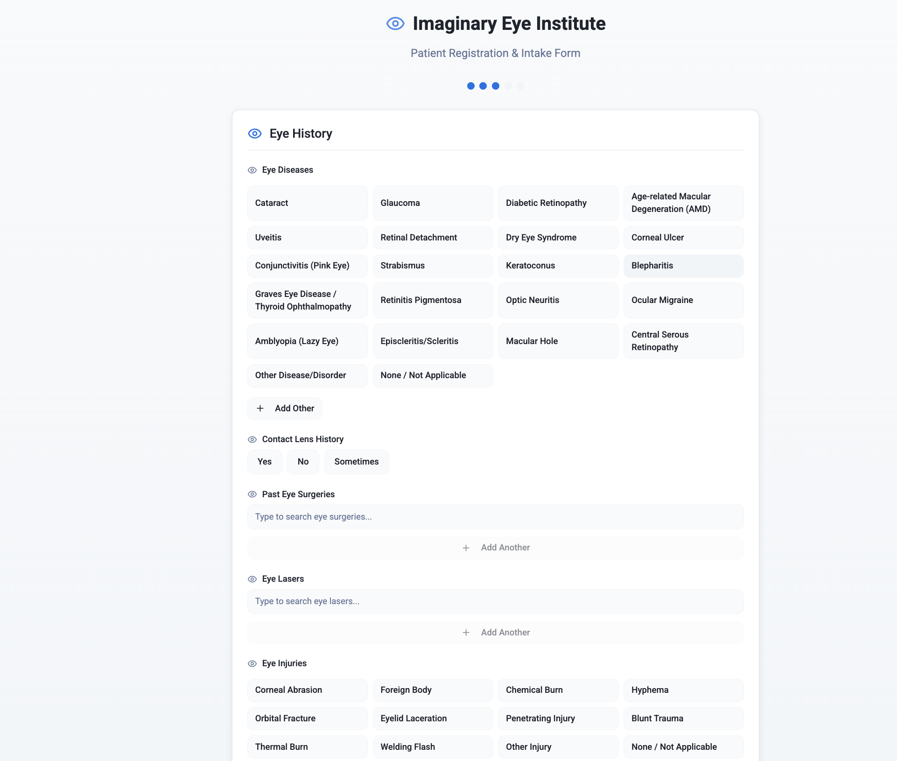
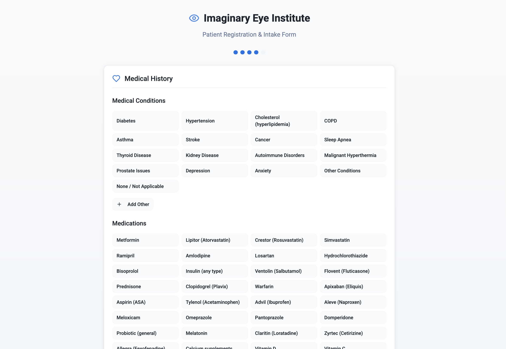
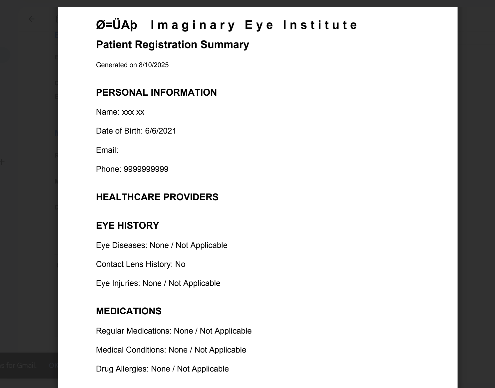

# Imaginary Eye Institute – Patient Registration Form (Prototype)

**A HIPAA-conscious, patient registration form.**  
This project is a **proof-of-concept**, developed out of conceptual interest to showcase full-stack automation—not intended for production without proper compliance measures.

**🔗 [Live Demo](https://patientregistration.lovable.app/)**

---

## 🚀 Features Overview

- **Structured Data Capture**  
  - Detailed patient intake covers demographics, optometry, medical history, surgeries, medications, allergies, and more.
  - Smart autocomplete suggest lists for long datasets, with support for “Other” (free-text), “+ Add Another”, and “None / Not Applicable” logic.

- **UI/UX Design**  
  - Field-level icons (person, phone, calendar) for intuitive input.
  - Clean layout with minimum 16px vertical spacing.
  - Robust input validation (e.g., phone number restricted to exactly 10 digits).

- **Automated Workflow**  
  - On submission, data is stored in the `patient_registrations` table in Supabase.
  - A Supabase Edge Function (`generate_patient_pdf`) is triggered to generate a professionally formatted PDF.
  - The PDF is emailed to the institute via SendGrid—completing the intake process seamlessly.

---

## 🔒 HIPAA & Privacy Considerations

This prototype is built with **privacy-aware practices**, though it's not production-ready:

- All communications should use **HTTPS** to encrypt data in transit.
- Stores data in Supabase securely—but no sensitive logging or unauthorized access.
- Implement **Row-Level Security (RLS)** and Supabase authentication before any production roll-out.
- Use **data minimization**—only collect what’s necessary, and clearly label optional free-text inputs.
  
> ⚠ **Disclaimer**: This app is for demonstration only. For clinical use, you must perform a full HIPAA audit and compliance review prior to deployment.

---

## 📸 Screenshots

| Patient Info Form | Autocomplete Inputs |
|-------------------|---------------------|
|  |  |

| Review & Submit | Generated PDF Workflow |
|-----------------|------------------------|
|  |  |

---

## 🛠 Tech Stack

- **Frontend**: Lovable
- **Backend**: Supabase (PostgreSQL database + Edge Functions)  
- **Email Delivery**: SendGrid integrated via Edge Function

---

📄 License
This project is licensed under the MIT License – see the LICENSE file for details.
